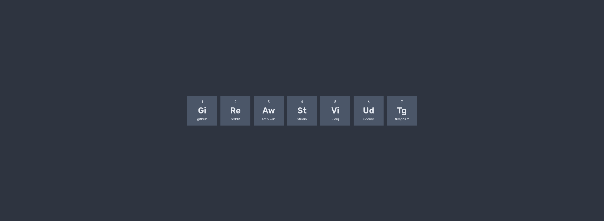

# Sutatopeji

A custom start page with links to URLs I often use. Instead of relying on UI libraries such as React or Vue to render components, I used custom the [Web Components API](https://developer.mozilla.org/en-US/docs/Web/Web_Components) that is supported by all modern browsers. The design was inspired by this [post](https://www.reddit.com/r/startpages/comments/wzw98e/simple_monochrome_homepage_and_a_script_to/) on Reddit.

## Web Components API Tutorial

A tutorial on how to use the [Web Components API](https://developer.mozilla.org/en-US/docs/Web/Web_Components) can be found [here](https://youtu.be/P1spwHdHqZI) one YouTube.

Feel free to customize this to your liking.

`git clone https://github.com/tuffgniuz/periodic-table-of-the-web`
